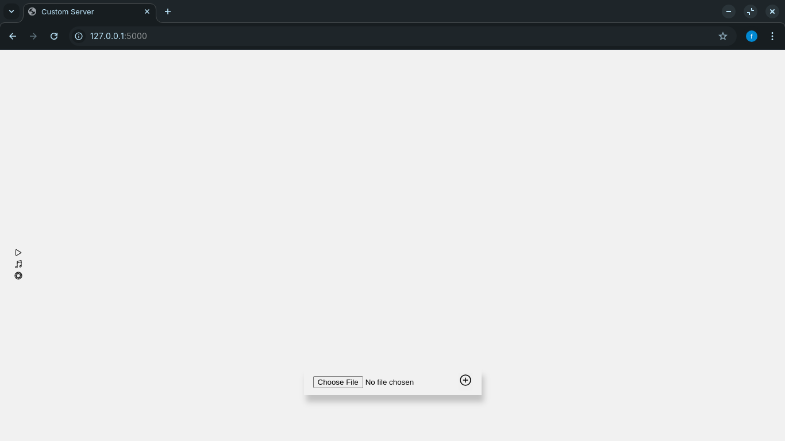
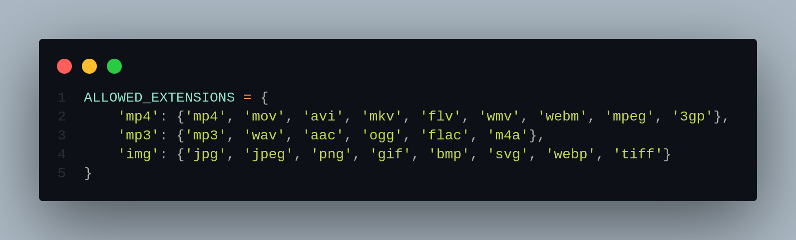

# Custom Web Server

**Reason for development:**
Sometimes I need to show some things to some people or I need to upload a file to my computer but I don't have the cables and things like that with me, so this gives me a storage space where I can show people what I need to show them and remotely upload and store files from my various devices.

**Libraries I used in the project:**

```bash
pip install flask pyngrok
```




I only used 3 file types, but you can use more as you wish.

- music files
- video files
- image files
